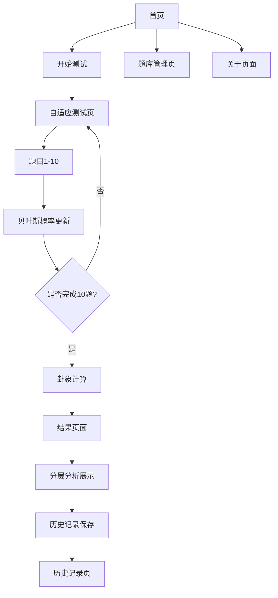

# 人格卦象映射系统产品需求文档

## 1. 产品概述

人格卦象映射系统是一个创新的心理测量平台，通过自适应心理量表测试结合周易卦象理论，为用户提供深度的人格分析和自我认知工具。系统不依赖传统的生辰八字，而是通过科学的心理测量方法生成个性化的"人格卦象映射"，帮助用户理解自己的内在动机和外在行为模式。

本系统旨在打造一个开源、透明、注重隐私保护的自我探索工具，为心理学爱好者和自我成长需求者提供东西方智慧结合的人格分析体验。

## 2. 核心功能

### 2.1 用户角色

| 角色 | 注册方式 | 核心权限 |
|------|----------|----------|
| 普通用户 | 无需注册，本地使用 | 进行心理测试、查看个人结果、本地历史记录 |
| 开发者 | GitHub贡献者 | 参与开源开发、提交题库、优化算法 |

### 2.2 功能模块

本系统包含以下核心页面：
1. **首页**：系统介绍、测试入口、功能导航
2. **自适应测试页**：智能题目推送、答题界面、进度显示
3. **卦象结果页**：分层映射展示、人格分析、发展建议
4. **历史记录页**：本地测试历史、结果对比、趋势分析
5. **题库管理页**：题目浏览、统计信息、透明度展示
6. **关于页面**：开源协议、伦理声明、使用指南

### 2.3 页面详情

| 页面名称 | 模块名称 | 功能描述 |
|----------|----------|----------|
| 首页 | 欢迎模块 | 展示系统理念、核心价值、开始测试引导 |
| 首页 | 导航模块 | 提供快速访问各功能模块的入口 |
| 首页 | 统计模块 | 显示系统使用统计、题库规模等信息 |
| 自适应测试页 | 题目展示 | 动态加载题目、四选一界面、选项权重透明 |
| 自适应测试页 | 进度跟踪 | 实时显示测试进度、贝叶斯概率更新可视化 |
| 自适应测试页 | 自适应引擎 | 基于贝叶斯算法的智能题目推荐系统，从60题库中动态选择最优题目 |
| 卦象结果页 | 主卦展示 | 显示上下卦组合、卦象图形、基础解读 |
| 卦象结果页 | 分层分析 | 三层映射策略：粗筛-细化-关联 |
| 卦象结果页 | 人格画像 | 内在动机与外在行为的详细分析 |
| 卦象结果页 | 发展建议 | 基于卦象理论的个人成长指导 |
| 卦象结果页 | 伦理提醒 | 明确工具的象征性、探索性目的声明 |
| 历史记录页 | 记录列表 | 本地存储的测试历史浏览 |
| 历史记录页 | 趋势分析 | 多次测试结果的变化趋势可视化 |
| 历史记录页 | 数据管理 | 导出、删除、备份个人数据 |
| 题库管理页 | 题目浏览 | 展示所有题目的中英文版本 |
| 题库管理页 | 参数透明 | 显示影响系数、区分度等统计参数 |
| 题库管理页 | 贡献指南 | 开源贡献流程、题目提交规范 |
| 关于页面 | 开源协议 | MIT协议声明、第三方库归属 |
| 关于页面 | 伦理声明 | 使用限制、免责声明、专业建议 |
| 关于页面 | 技术说明 | 算法原理、数据处理、隐私保护 |

## 3. 核心流程

### 3.1 主要用户操作流程

**普通用户测试流程：**
1. 用户访问首页，了解系统理念和功能
2. 点击开始测试，进入自适应测试页面
3. 系统基于贝叶斯算法推送第一题（内在动机或外在行为维度）
4. 用户选择答案，系统实时更新8种类型的概率分布
5. 系统根据当前概率分布选择最优下一题
6. 重复步骤4-5，完成10题测试
7. 系统计算最终的上下卦组合，生成64卦中的对应卦象
8. 展示分层分析结果：主卦+核心爻+关联卦
9. 用户查看详细的人格分析和发展建议
10. 结果自动保存到本地缓存，可在历史记录中查看

**开发者贡献流程：**
1. 访问GitHub仓库，了解贡献指南
2. 提交新题目或优化现有算法
3. 通过代码审查后合并到主分支
4. 更新题库CSV文件和相关文档



## 4. 自适应测试算法优化方案

### 4.1 题库扩展策略

**当前状态：** 题库包含10道题目（内在动机5题，外在行为5题）
**优化目标：** 扩展到60道题目（内在动机30题，外在行为30题）
**用户体验：** 用户仍然只需完成10道题目（内在动机5题，外在行为5题）

#### 4.1.1 题库结构设计

```
题库总体结构：
├── 内在动机维度题目 (30题)
│   ├── 成就动机相关 (6题)
│   ├── 安全动机相关 (6题)
│   ├── 关系动机相关 (6题)
│   ├── 自主动机相关 (6题)
│   └── 混合区分题目 (6题)
└── 外在行为维度题目 (30题)
    ├── 引领型行为 (6题)
    ├── 承载型行为 (6题)
    ├── 变通型行为 (6题)
    ├── 坚持型行为 (6题)
    └── 混合区分题目 (6题)
```

#### 4.1.2 题目分类与权重设计

每道题目包含以下属性：
- **维度类型**：内在动机 / 外在行为
- **主要区分目标**：针对哪两种或多种八卦类型的区分
- **区分度系数**：题目对不同类型的区分能力（0.1-1.0）
- **难度等级**：简单/中等/困难（影响推荐优先级）
- **八卦系数矩阵**：对8种基础类型的影响权重

### 4.2 自适应推荐算法

#### 4.2.1 贝叶斯概率更新机制

**核心原理：** 基于用户每次答题结果，实时更新8种基础类型（乾、坤、震、巽、坎、离、艮、兑）的概率分布

**更新公式：**
```
P(类型i|答案) = P(答案|类型i) × P(类型i) / P(答案)
其中：
- P(类型i)：当前类型i的先验概率
- P(答案|类型i)：在类型i条件下选择该答案的似然概率
- P(答案)：选择该答案的边际概率
```

#### 4.2.2 动态题目选择策略

**信息增益最大化原则：**
1. **熵计算**：计算当前概率分布的信息熵
   ```
   H(当前) = -Σ P(类型i) × log2(P(类型i))
   ```

2. **期望信息增益**：对于候选题目j，计算期望信息增益
   ```
   IG(题目j) = H(当前) - Σ P(答案k) × H(答案k后)
   ```

3. **题目推荐**：选择信息增益最大的题目作为下一题

#### 4.2.3 自适应推荐流程

**阶段一：初始探索（前3题）**
- 选择区分度最高的通用题目
- 快速缩小可能类型范围
- 平衡内在动机和外在行为维度

**阶段二：精确区分（中间4题）**
- 识别概率最高的2-3种类型
- 推荐专门区分这些类型的题目
- 动态调整维度比重

**阶段三：确认验证（最后3题）**
- 针对最可能的类型进行确认
- 选择高置信度验证题目
- 确保结果稳定性

### 4.3 算法实现架构

#### 4.3.1 核心组件

```typescript
interface AdaptiveTestEngine {
  // 题库管理
  questionBank: ExtendedQuestionBank;  // 60题完整题库
  
  // 状态管理
  currentProbabilities: TypeProbabilities;  // 8种类型概率
  answeredQuestions: number[];  // 已答题目ID
  testPhase: 'exploration' | 'discrimination' | 'confirmation';
  
  // 核心方法
  selectNextQuestion(): Question;  // 选择下一题
  updateProbabilities(answer: Answer): void;  // 更新概率
  calculateInformationGain(questionId: number): number;  // 计算信息增益
  isTestComplete(): boolean;  // 判断测试完成
}
```

#### 4.3.2 性能优化策略

- **预计算**：预先计算所有题目的信息增益矩阵
- **缓存机制**：缓存常见概率分布下的最优题目选择
- **并行计算**：使用Web Workers进行复杂计算
- **渐进式加载**：按需加载题目内容

### 4.4 质量保证与验证

#### 4.4.1 算法验证指标

- **收敛速度**：平均多少题后概率分布稳定
- **准确率**：与传统全量测试结果的一致性
- **置信度**：最终结果的统计置信水平
- **用户体验**：测试时长和满意度

#### 4.4.2 A/B测试方案

- **对照组**：使用原有10题固定测试
- **实验组**：使用60题自适应测试
- **评估维度**：准确性、用户满意度、测试时长
- **样本要求**：每组至少1000次测试

## 5. 用户界面设计

### 5.1 设计风格

- **主色调**：深蓝色(#1e3a8a)象征智慧与深度，金色(#f59e0b)代表启发与洞察
- **辅助色**：灰色系(#6b7280, #f3f4f6)用于背景和文本，绿色(#10b981)用于积极反馈
- **按钮风格**：圆角矩形设计，具有微妙阴影和悬停效果
- **字体**：中文使用思源黑体，英文使用Inter，代码使用JetBrains Mono
- **布局风格**：卡片式设计，响应式网格布局，顶部导航栏
- **图标风格**：线性图标配合实心图标，使用Heroicons图标库
- **卦象图形**：传统八卦符号，支持SVG矢量显示

### 5.2 页面设计概览

| 页面名称 | 模块名称 | UI元素 |
|----------|----------|--------|
| 首页 | 欢迎模块 | 渐变背景、大标题、副标题、CTA按钮，采用居中布局 |
| 首页 | 导航模块 | 水平导航栏，图标+文字，悬停效果，响应式折叠 |
| 首页 | 统计模块 | 数字卡片展示，动画计数效果，网格布局 |
| 自适应测试页 | 题目展示 | 大卡片容器，题目文本，四个选项按钮，选中状态反馈 |
| 自适应测试页 | 进度跟踪 | 进度条、步骤指示器、概率分布可视化图表 |
| 卦象结果页 | 主卦展示 | 大型卦象图形、卦名标题、基础属性标签 |
| 卦象结果页 | 分层分析 | 手风琴式展开面板、层级标题、详细内容区域 |
| 卦象结果页 | 人格画像 | 双栏布局、特征标签云、优势挑战对比 |
| 历史记录页 | 记录列表 | 时间轴样式、卡片列表、筛选排序控件 |
| 题库管理页 | 题目浏览 | 表格视图、分页控件、搜索过滤器 |
| 关于页面 | 内容展示 | 长文本排版、代码块高亮、链接样式 |

### 5.3 响应式设计

系统采用移动优先的响应式设计策略，支持桌面端、平板和手机端访问。在移动端优化触摸交互体验，确保测试过程的流畅性和可用性。主要断点设置为768px（平板）和1024px（桌面），采用弹性网格和流式布局。