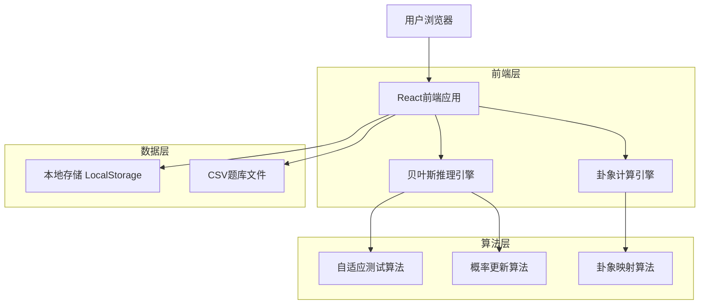

# 人格卦象映射系统技术架构文档

## 1. 架构设计



## 2. 技术描述

* **前端**: React\@18 + TypeScript + Tailwind CSS + Vite

* **状态管理**: Zustand

* **数据可视化**: Chart.js / D3.js

* **图标库**: Heroicons

* **数据存储**: 本地LocalStorage + CSV文件

* **算法库**: 自研贝叶斯推理引擎

* **构建工具**: Vite + ESLint + Prettier

## 3. 路由定义

| 路由          | 目的               |
| ----------- | ---------------- |
| /           | 首页，展示系统介绍和测试入口   |
| /test       | 自适应测试页面，进行心理量表测试 |
| /result/:id | 测试结果页面，显示卦象分析    |
| /history    | 历史记录页面，查看过往测试结果  |
| /database   | 题库管理页面，浏览题目和参数   |
| /about      | 关于页面，开源协议和使用说明   |

## 4. 核心数据结构

### 4.1 题目数据结构

```typescript
interface Question {
  id: string;
  category: 'inner_motivation' | 'outer_behavior'; // 内在动机 | 外在行为
  text_zh: string; // 中文题目
  text_en: string; // 英文题目
  options: QuestionOption[];
  difficulty: number; // 区分度 0-1
  usage_count: number; // 使用次数统计
}

interface QuestionOption {
  id: string;
  text_zh: string;
  text_en: string;
  // 对8种类型的影响系数 (-1 到 1)
  impact_coefficients: {
    qian: number;    // 乾卦系数
    kun: number;     // 坤卦系数
    zhen: number;    // 震卦系数
    xun: number;     // 巽卦系数
    kan: number;     // 坎卦系数
    li: number;      // 离卦系数
    gen: number;     // 艮卦系数
    dui: number;     // 兑卦系数
  };
}
```

### 4.2 测试状态数据结构

```typescript
interface TestSession {
  id: string;
  start_time: number;
  current_question_index: number;
  answers: TestAnswer[];
  // 当前概率分布
  probability_distribution: {
    inner_motivation: ProbabilityMap; // 内在动机概率
    outer_behavior: ProbabilityMap;   // 外在行为概率
  };
  is_completed: boolean;
}

interface TestAnswer {
  question_id: string;
  option_id: string;
  response_time: number; // 响应时间（毫秒）
  timestamp: number;
}

interface ProbabilityMap {
  qian: number;
  kun: number;
  zhen: number;
  xun: number;
  kan: number;
  li: number;
  gen: number;
  dui: number;
}
```

### 4.3 卦象结果数据结构

```typescript
interface HexagramResult {
  id: string;
  timestamp: number;
  session_id: string;
  
  // 主卦信息
  main_hexagram: {
    name_zh: string;
    name_en: string;
    upper_trigram: Trigram; // 上卦
    lower_trigram: Trigram; // 下卦
    hexagram_code: string;  // 64卦编码
  };
  
  // 分层分析结果
  analysis: {
    layer1_basic: BasicAnalysis;     // 第一层：基础分析
    layer2_detailed: DetailedAnalysis; // 第二层：爻位分析
    layer3_related: RelatedAnalysis;   // 第三层：关联卦象
  };
  
  // 概率分布快照
  final_probabilities: {
    inner_motivation: ProbabilityMap;
    outer_behavior: ProbabilityMap;
  };
}

interface Trigram {
  name_zh: string;
  name_en: string;
  symbol: string; // Unicode卦象符号
  element: string; // 五行属性
  attribute: string; // 卦象属性
}

interface BasicAnalysis {
  personality_type: string;
  core_motivation: string;
  behavior_pattern: string;
  strengths: string[];
  challenges: string[];
  compatibility: string; // 内外一致性评估
}

interface DetailedAnalysis {
  key_lines: LineAnalysis[]; // 关键爻位
  development_advice: string[];
  attention_points: string[];
}

interface LineAnalysis {
  position: number; // 爻位 1-6
  strength: number; // 强度 0-1
  interpretation: string;
}

interface RelatedAnalysis {
  complementary_hexagram: string; // 综卦
  opposite_hexagram: string;      // 错卦
  mutual_hexagram: string;        // 互卦
  fortune_analysis: string;       // 运势分析（娱乐性）
  ethical_reminder: string;       // 伦理提醒
}
```

## 5. 核心算法设计

### 5.1 贝叶斯自适应测试算法

```typescript
class BayesianAdaptiveTest {
  private questionPool: Question[];
  private currentProbabilities: {
    inner_motivation: ProbabilityMap;
    outer_behavior: ProbabilityMap;
  };
  
  constructor(questionPool: Question[]) {
    this.questionPool = questionPool;
    this.initializeProbabilities();
  }
  
  // 初始化均匀概率分布
  private initializeProbabilities(): void {
    const uniformProb = 1 / 8; // 8种类型均匀分布
    this.currentProbabilities = {
      inner_motivation: {
        qian: uniformProb, kun: uniformProb, zhen: uniformProb, xun: uniformProb,
        kan: uniformProb, li: uniformProb, gen: uniformProb, dui: uniformProb
      },
      outer_behavior: {
        qian: uniformProb, kun: uniformProb, zhen: uniformProb, xun: uniformProb,
        kan: uniformProb, li: uniformProb, gen: uniformProb, dui: uniformProb
      }
    };
  }
  
  // 选择下一个最优题目
  selectNextQuestion(answeredQuestions: string[]): Question | null {
    const availableQuestions = this.questionPool.filter(
      q => !answeredQuestions.includes(q.id)
    );
    
    if (availableQuestions.length === 0) return null;
    
    // 计算每个题目的信息增益
    let bestQuestion: Question | null = null;
    let maxInformationGain = -1;
    
    for (const question of availableQuestions) {
      const informationGain = this.calculateInformationGain(question);
      if (informationGain > maxInformationGain) {
        maxInformationGain = informationGain;
        bestQuestion = question;
      }
    }
    
    return bestQuestion;
  }
  
  // 计算信息增益
  private calculateInformationGain(question: Question): number {
    const currentEntropy = this.calculateEntropy(
      question.category === 'inner_motivation' 
        ? this.currentProbabilities.inner_motivation
        : this.currentProbabilities.outer_behavior
    );
    
    let expectedEntropy = 0;
    
    // 计算每个选项的期望熵
    for (const option of question.options) {
      const updatedProbs = this.simulateUpdate(question.category, option);
      const optionEntropy = this.calculateEntropy(updatedProbs);
      expectedEntropy += (1 / question.options.length) * optionEntropy;
    }
    
    return currentEntropy - expectedEntropy;
  }
  
  // 计算熵值
  private calculateEntropy(probabilities: ProbabilityMap): number {
    let entropy = 0;
    for (const prob of Object.values(probabilities)) {
      if (prob > 0) {
        entropy -= prob * Math.log2(prob);
      }
    }
    return entropy;
  }
  
  // 更新概率分布
  updateProbabilities(question: Question, selectedOption: QuestionOption): void {
    const category = question.category;
    const currentProbs = category === 'inner_motivation' 
      ? this.currentProbabilities.inner_motivation
      : this.currentProbabilities.outer_behavior;
    
    // 贝叶斯更新
    const updatedProbs: ProbabilityMap = {} as ProbabilityMap;
    let totalWeight = 0;
    
    for (const [type, currentProb] of Object.entries(currentProbs)) {
      const coefficient = selectedOption.impact_coefficients[type as keyof ProbabilityMap];
      const likelihood = Math.exp(coefficient); // 将系数转换为似然度
      const newWeight = currentProb * likelihood;
      updatedProbs[type as keyof ProbabilityMap] = newWeight;
      totalWeight += newWeight;
    }
    
    // 归一化
    for (const type of Object.keys(updatedProbs)) {
      updatedProbs[type as keyof ProbabilityMap] /= totalWeight;
    }
    
    if (category === 'inner_motivation') {
      this.currentProbabilities.inner_motivation = updatedProbs;
    } else {
      this.currentProbabilities.outer_behavior = updatedProbs;
    }
  }
  
  // 获取最终结果
  getFinalResult(): { innerType: string; outerType: string; confidence: number } {
    const innerType = this.getMaxProbabilityType(this.currentProbabilities.inner_motivation);
    const outerType = this.getMaxProbabilityType(this.currentProbabilities.outer_behavior);
    
    const innerConfidence = Math.max(...Object.values(this.currentProbabilities.inner_motivation));
    const outerConfidence = Math.max(...Object.values(this.currentProbabilities.outer_behavior));
    const confidence = (innerConfidence + outerConfidence) / 2;
    
    return { innerType, outerType, confidence };
  }
  
  private getMaxProbabilityType(probabilities: ProbabilityMap): string {
    return Object.entries(probabilities).reduce((a, b) => 
      probabilities[a[0] as keyof ProbabilityMap] > probabilities[b[0] as keyof ProbabilityMap] ? a : b
    )[0];
  }
}
```

### 5.2 卦象映射算法

```typescript
class HexagramMapper {
  private hexagramDatabase: HexagramData[];
  
  constructor(hexagramDatabase: HexagramData[]) {
    this.hexagramDatabase = hexagramDatabase;
  }
  
  // 根据内外类型映射到64卦
  mapToHexagram(innerType: string, outerType: string): HexagramData {
    const hexagramCode = this.generateHexagramCode(innerType, outerType);
    const hexagram = this.hexagramDatabase.find(h => h.code === hexagramCode);
    
    if (!hexagram) {
      throw new Error(`未找到对应卦象: ${innerType} + ${outerType}`);
    }
    
    return hexagram;
  }
  
  // 生成卦象编码
  private generateHexagramCode(innerType: string, outerType: string): string {
    const typeToTrigram: Record<string, string> = {
      'qian': '111', 'dui': '110', 'li': '101', 'zhen': '100',
      'xun': '011', 'kan': '010', 'gen': '001', 'kun': '000'
    };
    
    const lowerTrigram = typeToTrigram[innerType];
    const upperTrigram = typeToTrigram[outerType];
    
    return upperTrigram + lowerTrigram; // 6位二进制编码
  }
  
  // 生成分层分析
  generateLayeredAnalysis(
    hexagram: HexagramData, 
    probabilities: { inner_motivation: ProbabilityMap; outer_behavior: ProbabilityMap }
  ): {
    layer1_basic: BasicAnalysis;
    layer2_detailed: DetailedAnalysis;
    layer3_related: RelatedAnalysis;
  } {
    return {
      layer1_basic: this.generateBasicAnalysis(hexagram, probabilities),
      layer2_detailed: this.generateDetailedAnalysis(hexagram, probabilities),
      layer3_related: this.generateRelatedAnalysis(hexagram)
    };
```

