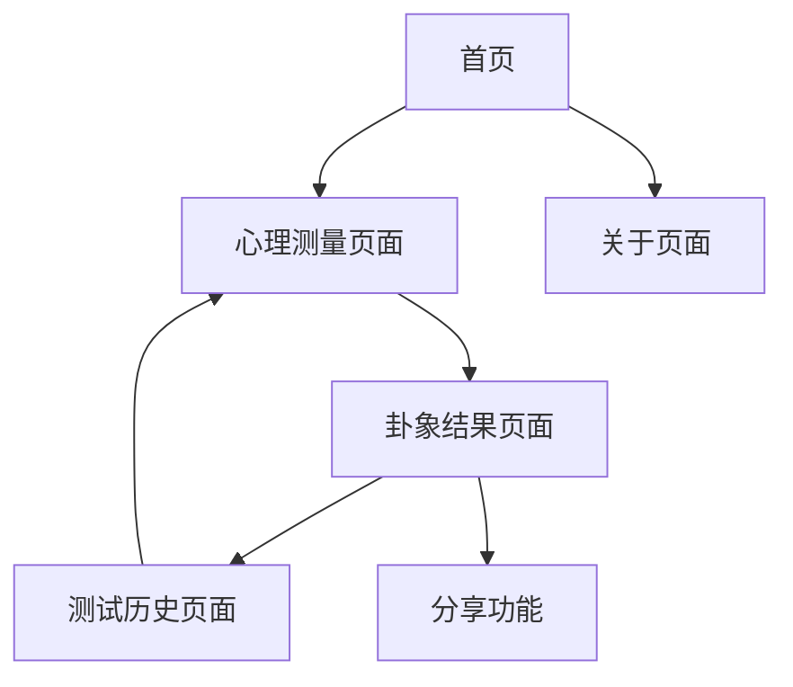

# 人格卦象映射网站产品需求文档

## 1. 产品概述

人格卦象映射网站是一个创新的心理测量与周易文化结合的在线平台，通过AI生成的自适应心理测量问题替代传统的生辰八字起卦方式，为用户提供个性化的卦象解读和人格分析。

该产品旨在为现代用户提供一种科学与传统文化相结合的自我认知工具，帮助用户了解自身性格特点、潜在问题及发展方向。目标是打造一个具有文化底蕴和科学依据的个人成长指导平台。

## 2. 核心功能

### 2.1 用户角色

| 角色 | 数据存储方式 | 核心权限 |
|------|-------------|----------|
| 普通用户 | 本地缓存存储 | 可进行心理测量、查看卦象解读结果、本地保存测试历史 |
| 会员用户 | 云端存储（开发中） | 跨设备同步、高级分析功能、个人成长轨迹等 |

### 2.2 功能模块

我们的人格卦象映射网站包含以下核心页面：

1. **首页**：产品介绍、功能说明、开始测试入口
2. **心理测量页面**：AI自适应问题生成、答题界面、进度显示
3. **卦象结果页面**：卦象展示、人格特点分析、问题与建议、运势解读
4. **测试历史页面**：历史记录查看、成长轨迹分析
5. **关于页面**：产品理念、算法说明、使用指南

### 2.3 页面详情

| 页面名称 | 模块名称 | 功能描述 |
|----------|----------|----------|
| 首页 | 产品介绍区 | 展示产品核心理念、特色功能，包含开始测试按钮 |
| 首页 | 功能特色区 | 介绍AI自适应测试、卦象映射算法、个性化解读等特色 |
| 首页 | 导航栏 | 提供页面导航、用户登录入口 |
| 心理测量页面 | AI问题生成器 | 根据用户前序答案动态生成后续问题，维持10题左右 |
| 心理测量页面 | 答题界面 | 提供多选题、量表评分等多种题型，支持进度保存 |
| 心理测量页面 | 进度指示器 | 显示当前测试进度、预计剩余时间 |
| 卦象结果页面 | 卦象展示区 | 显示匹配的卦象图案、卦名、卦辞 |
| 卦象结果页面 | 人格分析区 | 基于测试结果的详细人格特点分析 |
| 卦象结果页面 | 问题与建议区 | 分析可能面临的问题、提供解决建议和注意事项 |
| 卦象结果页面 | 运势解读区 | 提供近期运势分析和发展建议 |
| 卦象结果页面 | 分享功能 | 支持结果分享到社交媒体 |
| 测试历史页面 | 历史记录列表 | 显示用户历次测试结果、时间轴展示 |
| 测试历史页面 | 成长轨迹分析 | 对比分析不同时期的测试结果变化 |
| 关于页面 | 算法说明 | 介绍心理测量到卦象映射的算法原理 |
| 关于页面 | 使用指南 | 提供详细的使用说明和常见问题解答 |

## 3. 核心流程

**主要用户操作流程：**
用户访问首页了解产品 → 点击开始测试进入心理测量页面 → AI根据用户答案自适应生成约10个问题 → 完成测试后跳转到卦象结果页面查看详细分析 → 可选择保存结果或分享给他人。

**本地存储流程：**
用户的测试结果自动保存在浏览器本地缓存中，可在测试历史页面查看历史记录。会员注册按钮保留但点击时提示"会员功能正在开发中"。

## 4. 用户界面设计

### 4.1 设计风格

- **主色调**：深蓝色(#1a365d)和金色(#d69e2e)，体现传统文化的庄重与神秘
- **辅助色**：浅灰色(#f7fafc)和暖白色(#fffaf0)作为背景色
- **按钮样式**：圆角矩形按钮，带有渐变效果和悬停动画
- **字体**：中文使用思源黑体，英文使用Inter，标题18px，正文16px
- **布局风格**：卡片式设计，顶部导航栏，响应式布局
- **图标风格**：使用线性图标配合传统文化元素，如太极、八卦等符号

### 4.2 页面设计概览

| 页面名称 | 模块名称 | UI元素 |
|----------|----------|--------|
| 首页 | 产品介绍区 | 大标题、副标题、特色图标、渐变背景、CTA按钮 |
| 首页 | 功能特色区 | 三栏卡片布局、图标+文字说明、悬停效果 |
| 心理测量页面 | 答题界面 | 问题卡片、选项按钮、进度条、下一题按钮 |
| 心理测量页面 | 进度指示器 | 圆形进度环、百分比显示、预计时间 |
| 卦象结果页面 | 卦象展示区 | 卦象图案、卦名标题、卦辞文字、传统边框装饰 |
| 卦象结果页面 | 分析内容区 | 分栏布局、标签分类、可折叠内容区域 |
| 测试历史页面 | 历史记录 | 时间轴设计、卡片列表、筛选器、对比功能 |
| 关于页面 | 内容展示 | 文档式布局、目录导航、代码高亮显示 |

### 4.3 响应式设计

产品采用移动优先的响应式设计，支持桌面端、平板和手机端访问，针对触屏设备优化交互体验，确保在不同设备上都能提供良好的用户体验。

## 5. 开源项目说明

### 5.1 开源协议
本项目采用 MIT 开源协议，允许自由使用、修改和分发。

### 5.2 第三方库引用
- **bazi库**：用于周易卦象计算，遵循其原有开源协议
- 其他依赖库将在项目开发过程中根据实际使用情况在 README.md 和 package.json 中详细说明

### 5.3 贡献指南
欢迎社区贡献代码、文档和建议。所有贡献者需遵守项目的行为准则和代码规范。

### 5.4 免责声明
本项目仅供娱乐和自我认知参考，不构成专业心理咨询建议。卦象解读结果仅基于算法分析，不应作为重要决策依据。