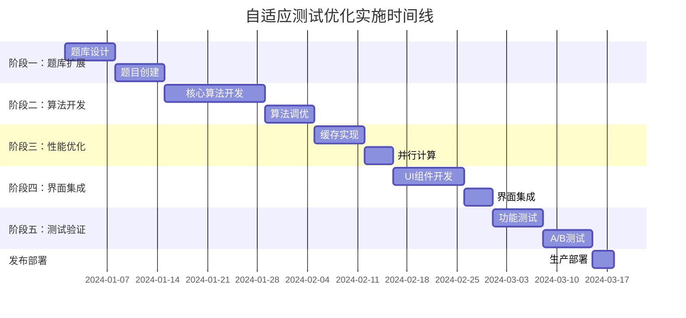

# 自适应测试优化实施方案

## 1. 项目概述

本文档详细描述了人格卦象映射系统自适应测试功能的优化实施方案。通过将题库从10题扩展到60题，并实现基于贝叶斯推理的智能题目推荐算法，在保持用户仍然只需完成10道题的前提下，显著提高测试的准确度和置信度。

**核心目标：**
- 扩展题库：内在动机和外在行为各30题（总计60题）
- 保持用户体验：用户仍然只做10道题（各5道）
- 提升测试质量：通过自适应算法提高准确度和置信度
- 实现真正的个性化测试体验

## 2. 实施阶段规划

### 阶段一：题库扩展与数据准备（预计2周）

#### 2.1 题库设计与创建

**任务清单：**
- [ ] 设计60题的题库结构
- [ ] 创建内在动机维度30题
- [ ] 创建外在行为维度30题
- [ ] 为每道题目设计4个选项
- [ ] 计算八卦系数矩阵
- [ ] 设置题目元数据（区分度、难度等级、适用阶段）

**题库分类策略：**
```
内在动机维度（30题）：
├── 成就动机相关（6题）
├── 安全动机相关（6题）
├── 关系动机相关（6题）
├── 自主动机相关（6题）
└── 混合区分题目（6题）

外在行为维度（30题）：
├── 引领型行为（6题）
├── 承载型行为（6题）
├── 变通型行为（6题）
├── 坚持型行为（6题）
└── 混合区分题目（6题）
```

**数据格式规范：**
```csv
id,category,subcategory,text_zh,text_en,difficulty,information_value,discrimination_targets,test_phase,complexity_level,option1_zh,option1_en,option1_qian,option1_kun,option1_zhen,option1_xun,option1_kan,option1_li,option1_gen,option1_dui,option2_zh,option2_en,option2_qian,option2_kun,option2_zhen,option2_xun,option2_kan,option2_li,option2_gen,option2_dui,option3_zh,option3_en,option3_qian,option3_kun,option3_zhen,option3_xun,option3_kan,option3_li,option3_gen,option3_dui,option4_zh,option4_en,option4_qian,option4_kun,option4_zhen,option4_xun,option4_kan,option4_li,option4_gen,option4_dui
```

#### 2.2 题目质量验证

**验证标准：**
- 区分度系数 ≥ 0.3
- 选项间八卦系数差异 ≥ 0.4
- 语言表达清晰无歧义
- 文化适应性良好

### 阶段二：自适应算法核心开发（预计3周）

#### 2.1 核心算法组件开发

**开发任务：**
- [ ] 实现 `EnhancedBayesianAdaptiveTest` 类
- [ ] 开发信息增益计算算法
- [ ] 实现三阶段题目选择策略
- [ ] 构建概率更新机制
- [ ] 开发阶段转换逻辑

**关键文件：**
```
src/utils/
├── adaptiveTestEngine.ts          # 自适应测试引擎
├── informationGainCalculator.ts   # 信息增益计算
├── phaseTransitionManager.ts      # 阶段转换管理
├── questionSelector.ts            # 智能题目选择
└── probabilityUpdater.ts          # 概率更新算法
```

#### 2.2 算法配置与调优

**默认配置参数：**
```typescript
const DEFAULT_CONFIG: AdaptiveAlgorithmConfig = {
  exploration_questions: 3,
  discrimination_questions: 4,
  confirmation_questions: 3,
  confidence_threshold: 0.7,
  entropy_threshold: 1.5,
  phase_transition_strategy: 'adaptive',
  information_gain_weight: 0.7,
  diversity_weight: 0.3
};
```

### 阶段三：性能优化与缓存实现（预计1.5周）

#### 3.1 计算性能优化

**优化策略：**
- [ ] 实现信息增益预计算
- [ ] 构建概率状态缓存
- [ ] 开发Web Worker并行计算
- [ ] 优化算法复杂度

**性能目标：**
- 题目选择响应时间 < 100ms
- 概率更新计算时间 < 50ms
- 内存使用量 < 50MB

#### 3.2 数据存储优化

**存储策略：**
- [ ] 实现IndexedDB存储
- [ ] 开发数据压缩算法
- [ ] 构建增量更新机制
- [ ] 实现离线数据同步

### 阶段四：用户界面集成（预计2周）

#### 4.1 测试界面优化

**界面改进：**
- [ ] 添加测试阶段指示器
- [ ] 实现概率分布可视化
- [ ] 开发置信度实时显示
- [ ] 优化题目切换动画

**新增组件：**
```
src/components/
├── AdaptiveTestInterface.tsx      # 自适应测试主界面
├── PhaseIndicator.tsx             # 阶段指示器
├── ProbabilityVisualization.tsx   # 概率分布图表
├── ConfidenceDisplay.tsx          # 置信度显示
└── QuestionTransition.tsx         # 题目切换动画
```

#### 4.2 结果展示增强

**结果页面优化：**
- [ ] 添加置信度评分
- [ ] 显示测试过程分析
- [ ] 展示概率收敛曲线
- [ ] 提供算法透明度说明

### 阶段五：测试验证与调优（预计2周）

#### 5.1 算法验证测试

**测试方案：**
- [ ] 单元测试覆盖率 ≥ 90%
- [ ] 集成测试验证
- [ ] 性能基准测试
- [ ] 用户体验测试

**验证指标：**
- 收敛速度：平均6题后概率分布稳定
- 准确率：与传统测试一致性 ≥ 85%
- 置信度：最终结果置信水平 ≥ 0.8
- 用户满意度：测试体验评分 ≥ 4.5/5

#### 5.2 A/B测试实施

**测试设计：**
- 对照组：原有10题固定测试
- 实验组：60题自适应测试
- 样本量：每组1000次测试
- 评估周期：2周

**评估维度：**
- 测试准确性对比
- 用户完成率对比
- 测试时长对比
- 用户满意度对比

## 3. 技术实现细节

### 3.1 核心算法实现

#### 信息增益计算公式
```typescript
// 当前熵值计算
function calculateEntropy(probabilities: ProbabilityMap): number {
  let entropy = 0;
  for (const prob of Object.values(probabilities)) {
    if (prob > 0) {
      entropy -= prob * Math.log2(prob);
    }
  }
  return entropy;
}

// 期望信息增益计算
function calculateExpectedInformationGain(
  question: ExtendedQuestion,
  currentProbs: ProbabilityMap
): number {
  const currentEntropy = calculateEntropy(currentProbs);
  let expectedEntropy = 0;
  
  for (const option of question.options) {
    const updatedProbs = simulateProbabilityUpdate(currentProbs, option);
    const optionEntropy = calculateEntropy(updatedProbs);
    const optionProbability = 1 / question.options.length; // 假设等概率选择
    expectedEntropy += optionProbability * optionEntropy;
  }
  
  return currentEntropy - expectedEntropy;
}
```

#### 贝叶斯概率更新
```typescript
function updateProbabilities(
  currentProbs: ProbabilityMap,
  selectedOption: QuestionOption
): ProbabilityMap {
  const updatedProbs: ProbabilityMap = {} as ProbabilityMap;
  let totalWeight = 0;
  
  // 计算新的权重
  for (const [type, currentProb] of Object.entries(currentProbs)) {
    const coefficient = selectedOption.impact_coefficients[type as keyof ProbabilityMap];
    const likelihood = Math.exp(coefficient); // 转换为似然度
    const newWeight = currentProb * likelihood;
    updatedProbs[type as keyof ProbabilityMap] = newWeight;
    totalWeight += newWeight;
  }
  
  // 归一化处理
  for (const type of Object.keys(updatedProbs)) {
    updatedProbs[type as keyof ProbabilityMap] /= totalWeight;
  }
  
  return updatedProbs;
}
```

### 3.2 性能优化实现

#### Web Worker并行计算
```typescript
// worker/informationGainWorker.ts
self.onmessage = function(event) {
  const { type, question, probabilityState } = event.data;
  
  if (type === 'COMPUTE_INFORMATION_GAIN') {
    const gain = computeInformationGain(question, probabilityState);
    self.postMessage({
      type: 'INFORMATION_GAIN_RESULT',
      gain: gain
    });
  }
};

function computeInformationGain(question: ExtendedQuestion, probs: ProbabilityMap): number {
  // 实现信息增益计算逻辑
  // ...
}
```

#### 缓存策略实现
```typescript
class InformationGainCache {
  private cache = new Map<string, number>();
  private maxCacheSize = 10000;
  
  getCachedGain(questionId: string, probState: string): number | null {
    const key = `${questionId}_${probState}`;
    return this.cache.get(key) || null;
  }
  
  setCachedGain(questionId: string, probState: string, gain: number): void {
    if (this.cache.size >= this.maxCacheSize) {
      // LRU淘汰策略
      const firstKey = this.cache.keys().next().value;
      this.cache.delete(firstKey);
    }
    
    const key = `${questionId}_${probState}`;
    this.cache.set(key, gain);
  }
}
```

## 4. 质量保证计划

### 4.1 代码质量标准

**代码规范：**
- TypeScript严格模式
- ESLint + Prettier代码格式化
- 函数复杂度 ≤ 10
- 代码覆盖率 ≥ 90%

**文档要求：**
- 所有公共API提供JSDoc注释
- 算法逻辑提供详细说明
- 配置参数提供使用指南

### 4.2 测试策略

**测试层级：**
1. **单元测试**：核心算法函数
2. **集成测试**：组件间交互
3. **端到端测试**：完整用户流程
4. **性能测试**：算法执行效率
5. **用户测试**：真实使用场景

**测试工具栈：**
- Jest + Testing Library（单元测试）
- Cypress（端到端测试）
- Lighthouse（性能测试）
- UserTesting（用户体验测试）

## 5. 风险评估与应对

### 5.1 技术风险

**风险1：算法复杂度过高**
- 影响：用户体验延迟
- 应对：实现渐进式计算和缓存优化
- 监控：响应时间指标

**风险2：题库质量不稳定**
- 影响：测试准确度下降
- 应对：建立题目验证流程和质量评估体系
- 监控：区分度和一致性指标

**风险3：内存使用过高**
- 影响：移动端性能问题
- 应对：实现数据压缩和懒加载
- 监控：内存使用量监控

### 5.2 用户体验风险

**风险1：测试时间过长**
- 影响：用户流失率增加
- 应对：优化算法收敛速度
- 监控：平均测试时长

**风险2：结果解释复杂**
- 影响：用户理解困难
- 应对：简化结果展示和增加说明
- 监控：用户满意度调研

## 6. 成功指标定义

### 6.1 技术指标

- **算法性能**：题目选择 < 100ms，概率更新 < 50ms
- **准确度提升**：与传统测试一致性 ≥ 85%
- **置信度提升**：最终结果置信水平 ≥ 0.8
- **收敛效率**：平均6题后概率分布稳定

### 6.2 用户体验指标

- **完成率**：测试完成率 ≥ 90%
- **满意度**：用户体验评分 ≥ 4.5/5
- **测试时长**：平均测试时间 ≤ 8分钟
- **重测率**：用户重复测试率 ≥ 20%

### 6.3 业务指标

- **用户增长**：月活跃用户增长 ≥ 30%
- **分享率**：结果分享率 ≥ 15%
- **留存率**：7日留存率 ≥ 40%
- **推荐度**：NPS评分 ≥ 50

## 7. 项目时间线



## 8. 后续优化方向

### 8.1 短期优化（3个月内）

- **个性化推荐**：基于用户历史数据优化题目选择
- **多语言支持**：扩展更多语言版本的题库
- **移动端优化**：针对移动设备的性能优化
- **数据分析**：用户行为和测试效果分析

### 8.2 中期规划（6个月内）

- **机器学习集成**：使用ML模型优化算法参数
- **社交功能**：添加结果分享和对比功能
- **专业版本**：面向心理咨询师的专业工具
- **API开放**：提供第三方集成接口

### 8.3 长期愿景（1年内）

- **多维度测评**：扩展到更多心理维度
- **动态题库**：基于用户反馈自动优化题库
- **智能报告**：AI生成个性化分析报告
- **生态建设**：构建心理测评工具生态系统

---

**文档版本：** v1.0  
**最后更新：** 2024年1月  
**负责人：** 产品开发团队  
**审核状态：** 待审核